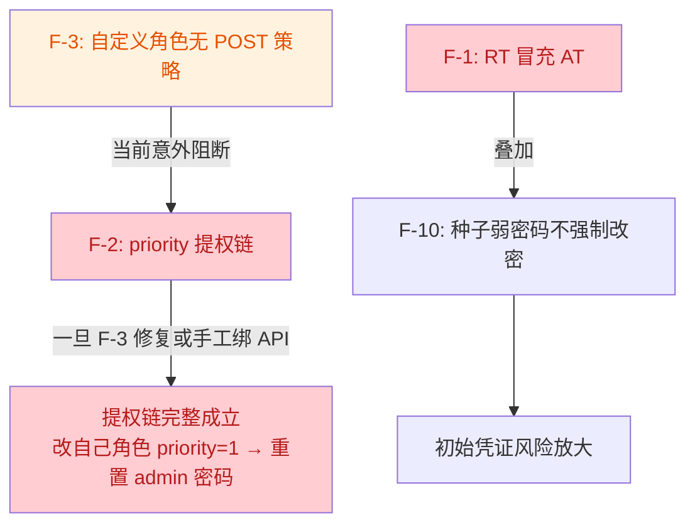

# Phase 1 代码审查发现（Code Review Findings）

> **审查范围**：`feature/step-1-infra` 分支相对 `origin/main` 的全部实现（140 个文件，含 3 个未推送提交，HEAD = `9ed7e88`）。
> **审查日期**：2026-08-19
> **审查方法**：核心链路人工逐行审查 + 两个独立子代理交叉验证（10 项发现全部 2/2 确认，无误报）。
> **本文档只记录发现，不含修复实现**；修复时逐项更新状态。
> **2026-08-19 更新**：F-1 ~ F-10 已全部修复，各条目状态附修复说明；单测 + 集成测试（testcontainers PG）全部通过。

---

## 1. 总体评价

整体架构分层清晰（handler / service / repository / middleware / pkg），以下做得好的部分应保持：

- bcrypt cost=12、RT 轮换用 `GetDel` + SHA-256 hash 比较防重放；
- 用户创建 / 软删除 / 角色菜单同步 Casbin 均在事务内完成，失败整体回滚；
- 优先级（priority）防提权体系、乐观锁（version）、最后超管保护（`CountActiveSuperadminUsers`）；
- release 模式启动时拦截弱 JWT 密钥（`config/validate.go`）；
- 组织 `Move` 的子树 `FOR UPDATE` 锁与 `IsDescendant` 环检测；
- JWT 中间件 fail-close（Redis 不可用即 503，不放过请求）。

存在 1 个严重安全漏洞、6 个重要缺陷、3 个次要问题。**特别注意问题 2 与问题 3 的联动**（见 §4）。

---

## 2. 问题清单

### 🔴 严重

#### F-1 RefreshToken 可直接当作 AccessToken 使用（令牌类型混淆）

- **位置**：`internal/pkg/jwt/jwt.go`（`GenerateAccessToken` / `GenerateRefreshToken` / `ParseAccessToken`）、`internal/middleware/jwt.go`
- **问题**：AT 与 RT 用同一密钥、同为 HS256 签发，claims 无 `typ` 等类型标识。`RefreshClaims` 的字段（`uid,string` / `jti` / `exp`）与 `AccessClaims` 完全兼容，`ParseAccessToken` 可成功解析 RT 并通过签名校验。
- **影响**：
  - RT 有效期 168h（`configs/config.yaml` `refresh_ttl`），冒充 AT 使用即绕过 30 分钟短时效设计；
  - 登出只拉黑 AT 的 jti、删除 RT 的 Redis key，**RT 字符串本身在 7 天内仍可作为 Bearer 凭证访问任意 API**，`Logout` / `revokeUserSessions`（disabled 键 TTL 仅 30m）均无法阻止；
  - RT 无 `mcp` 字段，冒充 AT 时 `MustChangePassword=false`，顺带绕过强制改密拦截（`middleware/jwt.go` L74）。
- **修复建议**：签发时写入 `typ: "access"` / `"refresh"` 声明；两个 Parse 函数严格校验 `typ`，不匹配即拒绝。
- **状态**：✅ 已修复 — `jwt.go` 新增 `TokenTypeAccess/Refresh` 常量，两类 claims 均写入 `typ` 并在 Parse 时严格校验（`ErrTokenTypeMismatch`）；`jwt_test.go` 覆盖 RT 冒充 AT 被拒。

### 🟠 重要

#### F-2 角色 priority 无校验，可通过 UpdateRole 提权

- **位置**：`internal/service/rbac_service.go` `CreateRole`（L45-65）/ `UpdateRole`（L67-85）
- **问题**：分配角色时有 `canAssignRole` 的 priority 下限校验（`priority.go`），但**创建 / 更新角色时完全不校验 priority**（`UpdateRole` 仅拦 `IsSystem`）。持有 roles 路由权限的非超管用户可把自己已有的自定义角色 priority 从 20 改为 1（甚至 0 / 负数，越过 superadmin 的 priority=1 底线），随后 `canManageTarget` 对 priority=10 的 admin 用户放行，经 `ensureCanManage` → `ResetPassword` 重置管理员密码，完成提权。
- **前置条件**：操作者已持有 `POST /api/v1/roles/update` 权限（当前因 F-3 该路径对自定义角色 403，见 §4 联动说明；admin/superadmin 本身可达）。
- **修复建议**：`CreateRole` / `UpdateRole` 校验 `req.Priority >= 操作者 effectivePriority`，且 priority 下限不小于 1。
- **状态**：✅ 已修复 — `rbac_service.go` 新增 `ensureRolePriorityAllowed`（基于 `canSetRolePriority`），`CreateRole` / `UpdateRole` 均调用；操作者无法创建/更新高于自身权限档位的 priority。

#### F-3 页面菜单绑定的 POST API 被过滤，自定义角色拿不到任何写权限

- **位置**：`internal/repository/menu_repo.go` `ListMenuAPIsByMenuIDs`（L69-70）
- **问题**：SQL 过滤条件 `(m.menu_type = 3 OR ma.api_method = 'GET')` 丢弃页面菜单（menu_type=2）绑定的非 GET API。而：
  - 种子（`migrations/000002_seed.up.sql` L90-126）把全部 POST 写路由（`/api/v1/users/update`、`/api/v1/users/password/reset` 等）绑在**页面菜单**（system_user 等）上；
  - 按钮菜单（menu_type=3）在种子中**没有任何 menu_apis 行**；
  - 文档 [07-menu.md](./07-menu.md) L248 明确设计为"角色绑定**页面菜单**即获得该页全部 `menu_apis`"。
- **影响**：给自定义角色分配"用户管理"页面 + 全部按钮后，Casbin 只生成 3 条 GET 策略，所有写操作 403。**授权核心功能对新角色系统性失效**，且种子数据与文档描述的行为无法实现。
- **修复建议**：按文档设计去掉该过滤条件（页面菜单授予其全部绑定 API）；或反向修正种子，把写 API 绑到按钮菜单。二选一，需与 [07-menu.md](./07-menu.md) 对齐后明确。
- **状态**：✅ 已修复 — `menu_repo.go` 移除 `(m.menu_type = 3 OR ma.api_method = 'GET')` 过滤，采用文档语义（页面菜单授予全部绑定 API）；F-2 已同步修复，联动提权链不成立。

#### F-4 修改密码只吊销当前设备会话

- **位置**：`internal/service/auth_service.go` `UpdatePassword`（L213-226）
- **问题**：改密成功后只删除当前 deviceID 的 RT key（`refreshKey(userID, deviceID)`）并拉黑当前 AT；**其他设备的 RT 不受影响**，且 `Refresh` 只检查签名 / user:disabled / DB status / RT hash（均与密码无关），其他设备可在 168h 内持续刷新。
- **对比**：`revokeUserSessions`（`session_revoke.go`）会 SCAN 删除全部 `refresh:{uid}:*` 并设置 `user:disabled`，已被 `Delete` / `UpdateStatus(禁用)` / `ResetPassword` 使用，唯独 `UpdatePassword` 未调用。
- **修复建议**：改密后调用 `revokeUserSessions` 吊销全部会话，再为当前设备签发新 Token 对。
- **状态**：✅ 已修复 — `UpdatePassword` 改密成功后调用 `revokeUserSessions` 吊销全部设备会话，再为当前设备签发新 Token 对。

#### F-5 审计日志用请求 context 写库，客户端断连即丢失

- **位置**：`internal/middleware/audit.go` L64
- **问题**：`c.Next()` 之后用 `c.Request.Context()` 调用 `Insert`。Go net/http 语义下请求 context 在**客户端连接关闭时取消**；响应已写完、客户端（curl / 移动端 / 代理超时）立即断连会使 pgx Exec 报 context canceled，审计记录静默丢失（仅 slog.Error）。攻击者也可故意提前断连规避审计。
- **对照文档**：[README §1.2](./README.md) 承诺"Phase 1 同步写入，**保证不丢**"，当前实现违背该承诺。
- **修复建议**：用 `context.WithoutCancel(c.Request.Context())`（Go 1.21+）叠加独立超时（如 3s）写入。
- **状态**：✅ 已修复 — `audit.go` 改用 `context.WithTimeout(context.WithoutCancel(...), 3s)` 写入；`audit_test.go` 验证客户端断连后审计仍落库。

#### F-6 唯一索引未过滤软删除，软删数据永久占用唯一键

- **位置**：`migrations/000001_init.up.sql` L29-33、L82
- **问题**：
  - `idx_users_employee_no`（L29-30）、`idx_users_domain_account`（L31-33）缺 `AND deleted_at IS NULL` 条件（对比 L52 `idx_roles_code`、L74 `idx_org_code` 均为部分唯一索引）；`SoftDelete` 不清理 employee_no → 软删用户的工号**永久无法复用**，同工号新建用户报"工号已存在"（`pgerr.go` 映射 `ErrEmployeeNoAlreadyExists`）；
  - `menus.code`（L82）为列级 UNIQUE，全局含软删行 → 软删菜单后同 code 无法重建（`menus_code_key` → `ErrMenuAlreadyExists`）。
- **修复建议**：新增迁移把三个索引重建为含 `deleted_at IS NULL` 的部分唯一索引（参照 roles / orgs 的写法）。
- **状态**：✅ 已修复 — 迁移 000006 将 `idx_users_employee_no` / `idx_users_domain_account` / `menus.code` 重建为部分唯一索引，并对历史软删行加 `#del#` 后缀清理占用；`pgerr.go` 映射同步（`menus_code_key` → `idx_menus_code`）；[04-user.md](./04-user.md) / [07-menu.md](./07-menu.md) 可复用规则已同步；`user_repo` 集成测试覆盖软删复用与活跃冲突。down 迁移已加固：冲突软删行（与活跃行或彼此同键）自动加 `#del#` 后缀让位，避免 up 后合法数据状态导致回滚硬失败置库 dirty（已在真实 PG 验证 up→冲突→down→up 全闭环）。

#### F-10 种子管理员 admin123 且不强制改密

- **位置**：`migrations/000002_seed.up.sql` L27-31
- **问题**：种子 admin 用户未设置 `must_change_password`（表默认 FALSE），系统已有 mcp 强制改密机制（登录签发 `MustChangePassword` 标记 + 中间件拦截）却未用于种子账号。首登不强制改密，弱初始凭证长期有效；叠加 F-1（RT 冒充 AT 也无 mcp 拦截）放大风险。
- **修复建议**：种子 INSERT 显式加 `must_change_password = true`。
- **状态**：✅ 已修复 — 种子 INSERT 加 `must_change_password = true`（F-10）；迁移 000007 同步修复存量环境的种子管理员。

### 🟡 次要

#### F-7 GetRoleCodesByUserID 忽略请求 context

- **位置**：`internal/service/rbac_service.go` L172-174
- **问题**：用 `context.Background()` 查库（方法签名无 ctx），由 Casbin 中间件在每个需鉴权请求上调用，请求取消 / 超时不传播，仅靠 DB `statement_timeout=30s` 兜底。
- **修复建议**：接口与方法签名加 `ctx` 参数，由中间件传入 `c.Request.Context()`。
- **状态**：✅ 已修复 — `GetRoleCodesByUserID` 签名加 `ctx`，Casbin 中间件传入 `c.Request.Context()`。

#### F-8 http.Server 缺超时配置

- **位置**：`internal/app/app.go` L36-39
- **问题**：仅设置 Addr / Handler，缺 `ReadTimeout` / `ReadHeaderTimeout` / `WriteTimeout` / `IdleTimeout`，存在 slowloris 慢连接资源耗尽面（内网后台暴露面有限，定级次要）。
- **修复建议**：补齐四项超时（如 ReadHeaderTimeout 10s / ReadTimeout 30s / WriteTimeout 60s / IdleTimeout 120s）。
- **状态**：✅ 已修复 — `app.go` 按建议值补齐四项超时。

#### F-9 密码无最小长度校验（文档已列 Phase 2 延期，酌情提前）

- **位置**：`internal/model/user_request.go`（`CreateUserRequest.Password` / `ResetPasswordRequest.Password` / `UpdatePasswordRequest.NewPassword`）
- **问题**：三处仅 `binding:"required"`，1 字符密码可创建 / 重置（含管理员重置他人密码场景）。[README §1.2](./README.md) 已将"密码复杂度策略"列为 Phase 2 延期项，属已知设计决策；但当前连最小长度都没有，且 F-10 的弱种子密码同样不受约束，建议至少提前加 `min=8` 下限。
- **修复建议**：binding 加 `min=8`；完整复杂度策略仍可留待 Phase 2。
- **状态**：✅ 已修复 — 三处密码字段 binding 加 `min=8`；完整复杂度策略留待 Phase 2。

---

## 3. 与文档一致、无需处理的事项

以下实现初看可疑，但确认为有意设计，**不构成问题**：

| 事项 | 依据 |
|------|------|
| CORS `AllowAllOrigins=true` 全放开 | `middleware/cors.go` 注释明确 Phase 1 策略，上线前收紧 |
| 登录锁定 15 分钟窗口 / 5 次上限 | `login_lock.lua` 与 `scripts.go` 语义一致（第 6 次失败锁定） |
| `admin` 角色在 Casbin model 中通配 bypass | `configs/casbin_model.conf` 注释 + 文档设计 |
| 审计同步写 DB（无队列） | README §1.2：Phase 3a 才做异步（但 F-5 的 ctx bug 不属于异步范畴，需修） |
| 允许多设备登录、无设备管理 UI | README §1.2：Phase 2 |

---

## 4. 问题联动关系（修复时必须一并考虑）

1. **F-2 ↔ F-3**：F-2 的纯 API 提权链当前被 F-3（自定义角色拿不到 `POST /roles/update` 策略）意外阻断——这不是有意防护。**修复 F-3 时必须同步修复 F-2**，否则提权链立即完整成立。
2. **F-1 + F-10**：RT 冒充 AT（无 mcp 拦截）+ 种子弱密码不强制改密，二者叠加显著放大初始凭证风险。

---

## 5. 修复优先级建议

| 优先级 | 项 | 理由 |
|--------|-----|------|
| P0（立即） | F-1 | 安全漏洞，登出 / 会话吊销机制被整体绕过 |
| P0（成对） | F-2 + F-3 | 授权体系核心缺陷，二者联动必须一起修 |
| P1 | F-4、F-5、F-10、F-6 | 会话安全 / 审计完整性 / 初始凭证 / 数据生命周期 |
| P2 | F-7、F-8、F-9 | 健壮性与防御纵深 |

---

## 6. 验证记录

- 每项发现均经过主审查 + 两个独立子代理（各自盲读源码）三重确认，10/10 全部属实；
- 已专门排查反例：`jwt.go` 无 typ/aud/独立密钥、role 链路无 priority 校验、`AssignMenus` 无补写 POST 策略的旁路、`UpdatePassword` 未调用 `revokeUserSessions`、audit 链路无 `WithoutCancel`、索引定义与 `pgerr.go` 映射逐行核对；
- F-3 与文档 [07-menu.md](./07-menu.md) §L248、种子 SQL L90-126 逐条比对确认矛盾。
