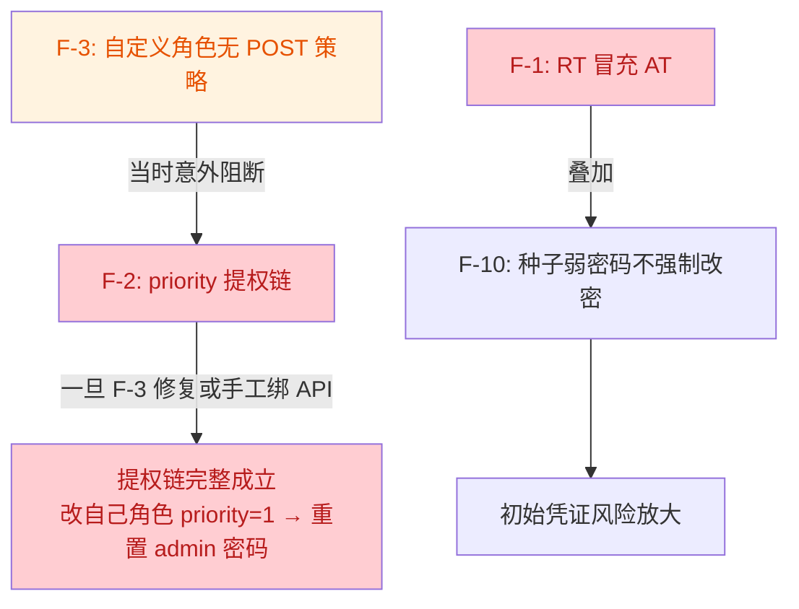

# 11 - Phase 1 代码审查报告（2026-08-19）

> **审查范围**：两轮独立审查合并——① `feature/step-1-infra` 相对 `origin/main` 的**全分支深度审查**（140 个文件，含 3 个未推送提交，HEAD = `9ed7e88`）；② 以本地 3 个提交（Casbin 自服务标签重构 / 用户软删除级联清理 / APP_SERVER_MODE 修复）为核心的**定向审查**。  
> **方法**：核心链路人工逐行审查 + 独立子代理交叉验证（F-1~F-10 全部 2/2 确认，无误报）；定向审查部分经实测复核（两处初版误报已勘误，见 §6）。  
> **结论**：`go build` / `go vet` / 单测 / 集成测试（testcontainers PG）全部通过。发现 1 严重 + 6 重要 + 3 次要（F 系列）+ 3 P1（定向）+ 6 P2（定向）。  
> **修复状态（2026-08-19）**：F-1~F-10 与定向 §2.1/§2.2/§2.3 已全部修复（提交 8be8205..d54bda6）；P2 系列记录在案。  
> 本文由原两份审查文档（全分支 findings + 定向 review）合并而成；F-5 与定向 §1.1 为同一问题，已归并。

---

## 1. 总体评价

整体架构分层清晰（handler / service / repository / middleware / pkg），以下做得好的部分应保持：

- bcrypt cost=12、RT 轮换用 `GetDel` + SHA-256 hash 比较防重放；
- 用户创建 / 软删除 / 角色菜单同步 Casbin 均在事务内完成，失败整体回滚；
- 优先级（priority）防提权体系、乐观锁（version）、最后超管保护；
- release 模式启动时拦截弱 JWT 密钥（`config/validate.go`）；
- 组织 `Move` 的子树 `FOR UPDATE` 锁与 `IsDescendant` 环检测；
- JWT 中间件 fail-close（Redis 不可用即 503，不放过请求）。

定向审查确认无误的部分：SelfService 标签方案中间件顺序正确、SoftDelete 级联原子性正确、`APP_SERVER_MODE` 环境变量覆盖实测生效、superadmin 保护链完整（不能删自己/系统用户/最后一人）、登录审计全分支覆盖（service 层显式调用，有意不走中间件）、Dockerfile 路径与 config 硬编码匹配、审计脱敏覆盖 5 类敏感字段。

---

## 2. 严重与重要问题（F 系列，全分支审查）

### 🔴 严重

#### F-1 RefreshToken 可直接当作 AccessToken 使用（令牌类型混淆）

- **位置**：`internal/pkg/jwt/jwt.go`（`GenerateAccessToken` / `GenerateRefreshToken` / `ParseAccessToken`）、`internal/middleware/jwt.go`
- **问题**：AT 与 RT 用同一密钥、同为 HS256 签发，claims 无 `typ` 等类型标识。`RefreshClaims` 字段与 `AccessClaims` 完全兼容，`ParseAccessToken` 可成功解析 RT 并通过签名校验。
- **影响**：
  - RT 有效期 168h，冒充 AT 使用即绕过 30 分钟短时效设计；
  - 登出只拉黑 AT 的 jti、删除 RT 的 Redis key，**RT 字符串本身在 7 天内仍可作为 Bearer 凭证访问任意 API**，`Logout` / `revokeUserSessions` 均无法阻止；
  - RT 无 `mcp` 字段，冒充 AT 时顺带绕过强制改密拦截。
- **状态**：✅ 已修复 — `jwt.go` 新增 `TokenTypeAccess/Refresh` 常量，两类 claims 均写入 `typ` 并在 Parse 时严格校验（`ErrTokenTypeMismatch`）；`jwt_test.go` 覆盖双向冒充被拒。

### 🟠 重要

#### F-2 角色 priority 无校验，可通过 UpdateRole 提权

- **位置**：`internal/service/rbac_service.go` `CreateRole` / `UpdateRole`
- **问题**：分配角色时有 `canAssignRole` 的 priority 校验，但**创建 / 更新角色时完全不校验 priority**。持有 roles 路由权限的非超管用户可把自己已有角色的 priority 改为 1（越过 superadmin 底线），随后经 `canManageTarget` 放行重置管理员密码，完成提权。
- **前置条件**：操作者已持有 `POST /api/v1/roles/update` 权限（审查时因 F-3 该路径对自定义角色 403，见 §4 联动；admin/superadmin 本身可达）。
- **状态**：✅ 已修复 — 新增 `ensureRolePriorityAllowed`（基于 `canSetRolePriority`，含 `priority<1` 纵深防御），`CreateRole` / `UpdateRole` 均调用。

#### F-3 页面菜单绑定的 POST API 被过滤，自定义角色拿不到任何写权限

- **位置**：`internal/repository/menu_repo.go` `ListMenuAPIsByMenuIDs`
- **问题**：SQL 过滤条件 `(m.menu_type = 3 OR ma.api_method = 'GET')` 丢弃页面菜单绑定的非 GET API。种子把全部 POST 写路由绑在**页面菜单**上；按钮菜单在种子中没有任何 menu_apis 行；[07-menu.md](./07-menu.md) 明确设计为"角色绑定页面菜单即获得该页全部 `menu_apis`"。
- **影响**：给自定义角色分配"用户管理"页面 + 全部按钮后，Casbin 只生成 GET 策略，所有写操作 403。**授权核心功能对新角色系统性失效**。
- **状态**：✅ 已修复 — 移除过滤条件，采用文档语义（页面菜单授予全部绑定 API）；F-2 已同步修复，联动提权链不成立。

#### F-4 修改密码只吊销当前设备会话

- **位置**：`internal/service/auth_service.go` `UpdatePassword`
- **问题**：改密成功后只删当前 deviceID 的 RT 并拉黑当前 AT；**其他设备的 RT 不受影响**，可在 168h 内持续刷新（`Refresh` 各检查项均与密码无关）。`revokeUserSessions` 已被 `Delete` / `UpdateStatus(禁用)` / `ResetPassword` 使用，唯独 `UpdatePassword` 未调用。
- **状态**：✅ 已修复 — 改密成功后调用 `revokeUserSessions` 吊销全部设备会话，再为当前设备签发新 Token 对（`clearUserDisabled` 后签发，避免新 AT 被自己刚设的拒绝标记拦截）。

#### F-5 审计日志用请求 context 写库，客户端断连即丢失（= 定向审查 P0 §1.1，同一问题两轮独立发现）

- **位置**：`internal/middleware/audit.go`
- **问题**：`c.Next()` 之后用 `c.Request.Context()` 调用 `Insert`。请求 context 在客户端连接关闭时取消——**恰恰是异常场景（攻击者发完删除请求立刻断连规避审计）下审计最不该丢**。违背 README §1.2「Phase 1 同步写入，保证不丢」承诺。优雅关闭期间同理。
- **状态**：✅ 已修复 — 改用 `context.WithTimeout(context.WithoutCancel(...), 3s)` 写入；`audit_test.go` 验证客户端断连后审计仍落库。

#### F-6 唯一索引未过滤软删除，软删数据永久占用唯一键

- **位置**：`migrations/000001_init.up.sql`
- **问题**：`idx_users_employee_no` / `idx_users_domain_account` 缺 `AND deleted_at IS NULL`（对比 roles / orgs 均为部分唯一索引）；`menus.code` 为列级 UNIQUE。软删用户的工号**永久无法复用**；软删菜单同 code 无法重建。
- **状态**：✅ 已修复 — 迁移 000006 重建三个索引为部分唯一索引，历史软删行加 `#del#` 后缀清理；`pgerr.go` 映射同步；[04-user.md](./04-user.md) / [07-menu.md](./07-menu.md) 可复用规则已同步；集成测试覆盖软删复用与活跃冲突。down 迁移已加固：冲突软删行自动让位（活跃行优先），已在真实 PG 验证 up→冲突→down→up 闭环。

#### F-10 种子管理员 admin123 且不强制改密

- **位置**：`migrations/000002_seed.up.sql`
- **问题**：种子 admin 未设置 `must_change_password`（默认 FALSE），系统已有 mcp 强制改密机制却未用于种子账号。叠加 F-1（RT 冒充 AT 无 mcp 拦截）放大初始凭证风险。
- **状态**：✅ 已修复 — 种子 INSERT 加 `must_change_password = true`；迁移 000007 同步修复存量环境。

### 🟡 次要

#### F-7 GetRoleCodesByUserID 忽略请求 context

- **问题**：用 `context.Background()` 查库（签名无 ctx），由 Casbin 中间件每请求调用，取消/超时不传播。
- **状态**：✅ 已修复 — 签名加 `ctx`，中间件传入 `c.Request.Context()`。

#### F-8 http.Server 缺超时配置

- **问题**：仅设置 Addr / Handler，存在 slowloris 慢连接资源耗尽面。
- **状态**：✅ 已修复 — 补齐四项超时（ReadHeader 10s / Read 30s / Write 60s / Idle 120s）。

#### F-9 密码无最小长度校验

- **问题**：三处密码字段仅 `required`，1 字符密码可创建/重置。[README §1.2](./README.md) 已将复杂度策略列为 Phase 2 延期项，但连最小长度都没有。
- **状态**：✅ 已修复 — 三处 binding 加 `min=8`；完整复杂度策略留待 Phase 2（见 [phase2/01-auth-enhance.md](../phase2/01-auth-enhance.md)）。

---

## 3. 定向审查发现（本地 3 提交）

### 3.1 P1：Casbin enforce 错误与 403 拒绝均无日志

- **问题**：enforce 报错（adapter 故障、模型错误）被静默吞掉，最终以 503 返回无日志；被拒请求（403 + 70001）也不留痕。安全系统里「谁在何时被拒绝了什么」是排查与审计刚需。
- **状态**：✅ 已修复 — `CasbinAuth` 增加 logger 参数，enforce 错误记 Error（subject/path/method/error），最终 deny 记 Warn（userID/username/path/method/roles）。

### 3.2 P1：最后 superadmin 保护存在 TOCTOU 竞态

- **问题**：`UserService.Delete` / `UpdateStatus` / `SetRoles` 中 `CountActiveSuperadminUsers` 检查与后续写操作**不在同一事务**。两个并发请求可同时通过 `n<=1` 检查（各读到 n=2），联手删光/禁光所有 superadmin。
- **状态**：✅ 已修复 — `user_repo.go` 新增 `RunInTx` / `AcquireSuperadminGuard`（`pg_advisory_xact_lock`）/ `CountActiveSuperadminUsersTx` / `SoftDeleteTx` / `UpdateStatusTx` / `SetRolesTx`；三个方法中检查与写移入同一事务并加 advisory lock。集成测试覆盖最后一名超管不可删/禁与锁串行化。
- **复验补充**：初版修复在 `UpdateStatus` 超管守护分支引入回归——事务成功后直接 return，跳过 `revokeUserSessions`，被禁用超管的存量 AT 仍可用最长 30 分钟。已补吊销调用，[02-auth.md](./02-auth.md) §会话吊销同步标注"含守护分支"。

### 3.3 P1：测试覆盖与「模拟链路」测试盲区

- **审查时现状**：`repository` / `service` / `handler` / `router` 全部无测试；自服务标签测试是手动模拟（`c.Set("self_service", true)`），若有人调换中间件注册顺序测试依然全绿；SoftDelete 级联无任何测试。
- **状态**：✅ 已修复 — ① 导出 `SelfServiceContextKey` 常量；② 新增 `router/router_test.go`：真实路由树 + stub RoleFetcher，覆盖 viewer 自服务放行 / 业务路由 403 / 零角色拒绝 / admin 放行 / 公开路由不挂 JWT（中间件顺序本身被验证）；③ 新增 `repository/user_repo_integration_test.go`（testcontainers PG）：级联清理、回滚、F-6 复用断言、超管守护与锁串行化。

### 3.4 P2（记录在案，择机处理）

| # | 项 | 说明 |
|---|----|------|
| P2-1 | `viper.BindEnv` 错误被忽略 / 全局 viper 不可重入 | `config.go` 三处 `BindEnv` error 被丢弃；单次调用无碍，测试中多次 Load 可能互相污染 |
| P2-2 | `userSelectColumns` 无表前缀，JOIN 写法脆弱 | `ListByOrgID` JOIN `user_orgs` 使用该常量；将来 `user_orgs` 加与 users 同名列即触发 ambiguous 错误 |
| P2-3 | Casbin 无自动 reload 路径 | cleanup 调 `StopAutoLoadPolicy` 但从未 `StartAutoLoadPolicy`；直接改 `casbin_rule` 表需重启进程或触发 AssignMenus——运维需知晓 |
| P2-4 | SoftDelete 与会话吊销非原子 | `SoftDelete` 成功后 `revokeUserSessions` 失败：用户已删但旧 AT 仍可用至 Redis 恢复。可接受；建议至少 log.Error + 对账任务 |
| P2-5 | `List` 的 count 与 list 非同一快照 | 先 COUNT 后 SELECT，并发写时 total 可能与实际行数不一致。分页普遍接受 |
| P2-6 | 新增配置项只写代码默认值未进 yaml 时无法用环境变量覆盖 | viper AutomaticEnv 盲区，运维需知晓（见 §6.1） |

---

## 4. 问题联动关系（修复时已一并考虑）

1. **F-2 ↔ F-3**：F-2 的纯 API 提权链当时被 F-3（自定义角色拿不到 `POST /roles/update` 策略）意外阻断——不是有意防护。两者已同步修复。
2. **F-1 + F-10**：RT 冒充 AT（无 mcp 拦截）+ 种子弱密码不强制改密，叠加放大初始凭证风险。均已修复。

---

## 5. 与文档一致、无需处理的事项

| 事项 | 依据 |
|------|------|
| CORS `AllowAllOrigins=true` 全放开 | `middleware/cors.go` 注释明确 Phase 1 策略，上线前收紧 |
| 登录锁定 15 分钟 / 5 次上限（第 6 次失败锁定） | `login_lock.lua` 与 `scripts.go` 语义一致 |
| `admin` 角色在 Casbin model 中通配 bypass | `configs/casbin_model.conf` 注释 + 文档设计 |
| 审计同步写 DB（无队列） | README §1.2：Phase 3a 才做异步（F-5 的 ctx bug 不属异步范畴，已修） |
| 允许多设备登录、无设备管理 UI | README §1.2：Phase 2 |

---

## 6. 勘误：初版误报记录（审查方法教训）

### 6.1 误报：`APP_*` 环境变量"白名单陷阱"（初版 P0）

**初版结论**（错误）：仅 `APP_SERVER_MODE`/`JWT_SECRET`/`DB_PASSWORD`/`REDIS_PASSWORD` 生效，其余 `APP_*` 静默失效。

**实测推翻**（`t.Setenv` + `Load`）：`APP_DATABASE_HOST` / `APP_REDIS_PORT` / `APP_DATABASE_SSLMODE` / `APP_SERVER_MODE` 全部生效。

**准确规则**（viper `AutomaticEnv` + `SetEnvPrefix("APP")` + `SetEnvKeyReplacer`）：

| 键的来源 | 对应环境变量 | 是否生效 |
|----------|--------------|---------|
| yaml 中已存在的键 | `APP_<SECTION>_<KEY>` | ✅ 全部生效 |
| 显式 `BindEnv` 的键 | 绑定名（`JWT_SECRET` 等无前缀别名） | ✅ 生效 |
| yaml 中**不存在**的键 | 任何变量 | ❌ 不生效（唯一盲区，已记入 §3.4 P2-6） |

### 6.2 误报：`/auth/login` 无登录审计（初版 P2）

**初版结论**（错误）：登录成败均无操作审计。

**复核推翻**：`AuthService.Login` 在**所有分支**显式调用 `s.auditService.LogLogin`——参数错误 400 / 锁定 429 / 用户不存在 401 / 禁用 401 / 密码错误 401 / 成功 200 全覆盖；`audit_service.go` 注释明确"公开路由不走 AuditLog 中间件，由 AuthService 显式调用"为有意设计。初版仅检查了路由与中间件层，未查 service 层。

**教训**：审查"某能力是否存在"时必须检索实现层（service），不能只看挂载层（router/middleware）。

---

## 7. 修复状态总表

| 优先级 | 项 | 状态 |
|--------|-----|------|
| P0 | F-1 令牌类型混淆 | ✅ 已修复（双向 typ 校验 + 单测） |
| P0（成对） | F-2 + F-3 提权链 | ✅ 已同步修复 |
| P1 | F-4 改密吊销全设备 | ✅ 已修复 |
| P1 | F-5 审计 context（=定向 §1.1） | ✅ 已修复（WithoutCancel + 单测） |
| P1 | F-6 软删唯一索引 | ✅ 已修复（000006 + down 加固 + 集成测试） |
| P1 | F-10 种子强制改密 | ✅ 已修复（000002 + 000007） |
| P1 | 定向 §3.1 Casbin 日志 | ✅ 已修复 |
| P1 | 定向 §3.2 TOCTOU（含复验回归修复） | ✅ 已修复（advisory lock + 集成测试） |
| P1 | 定向 §3.3 测试补齐 | ✅ 已修复（router 链路 + 级联集成测试） |
| P2 | F-7 ctx 传播 / F-8 超时 / F-9 min=8 | ✅ 已修复 |
| P2 | 定向 §3.4 P2-1~P2-6 | 📋 记录在案，择机处理 |

**验证记录**：每项发现均经主审查 + 独立子代理盲读源码交叉确认；已专门排查反例（jwt.go 无 typ/aud/独立密钥、role 链路无 priority 校验、`AssignMenus` 无补写 POST 策略旁路、`UpdatePassword` 未调用 `revokeUserSessions`、audit 链路无 `WithoutCancel`、索引定义与 `pgerr.go` 映射逐行核对）；F-3 与 07-menu.md §L248、种子 SQL 逐条比对确认矛盾。修复后全量回归：`go build` / `go vet` / 单测 6 包 / 集成测试 7 包（-race）全绿。
